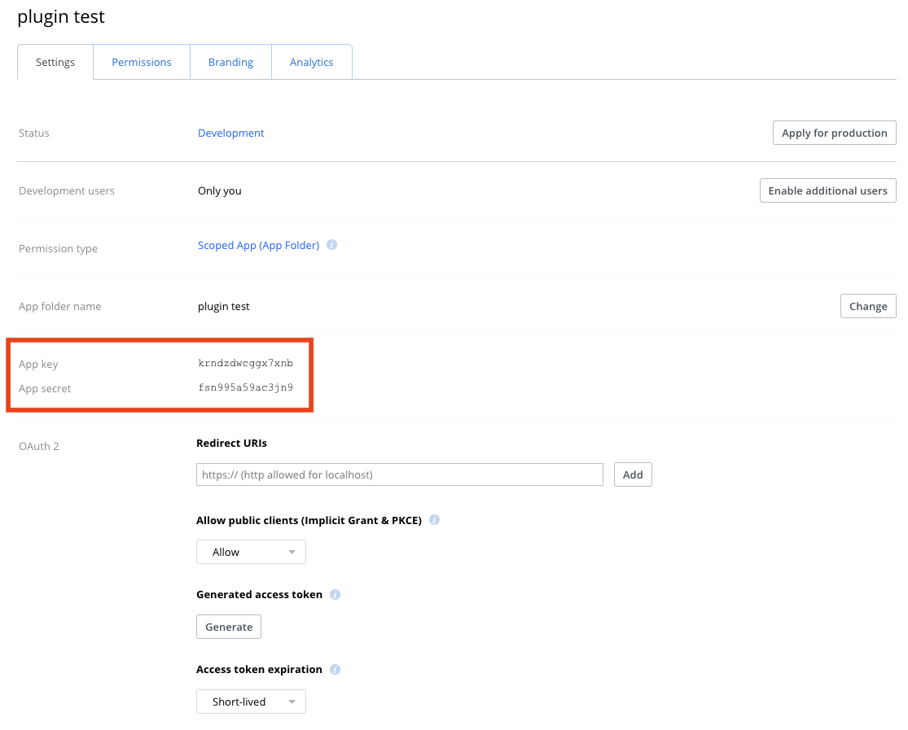
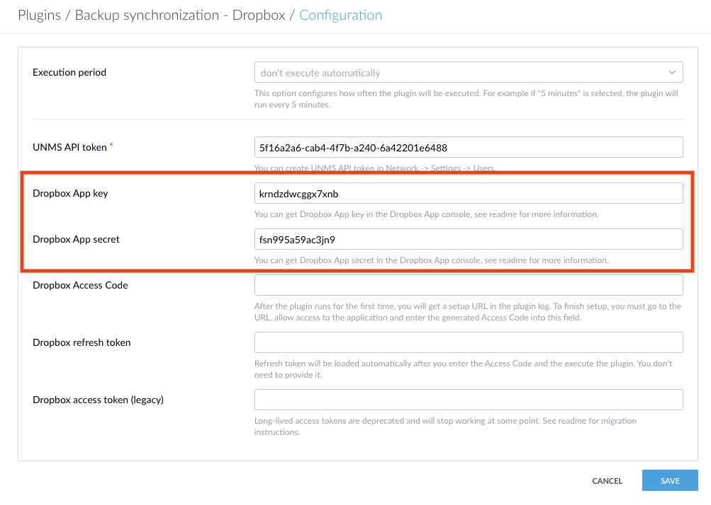
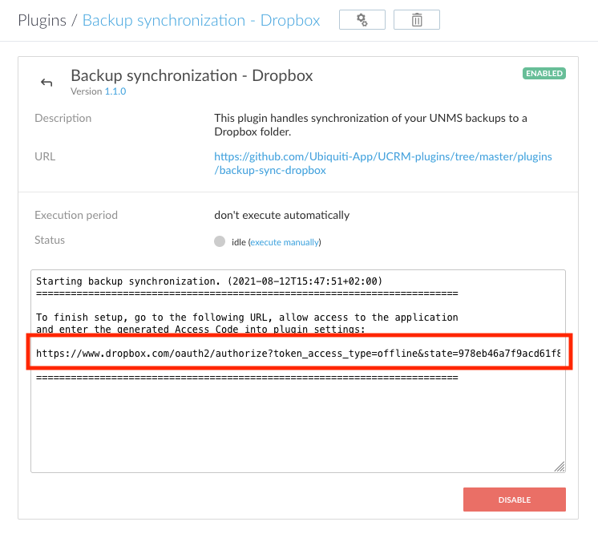
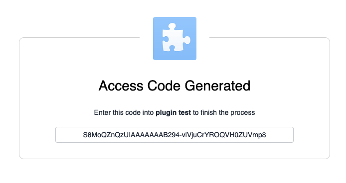
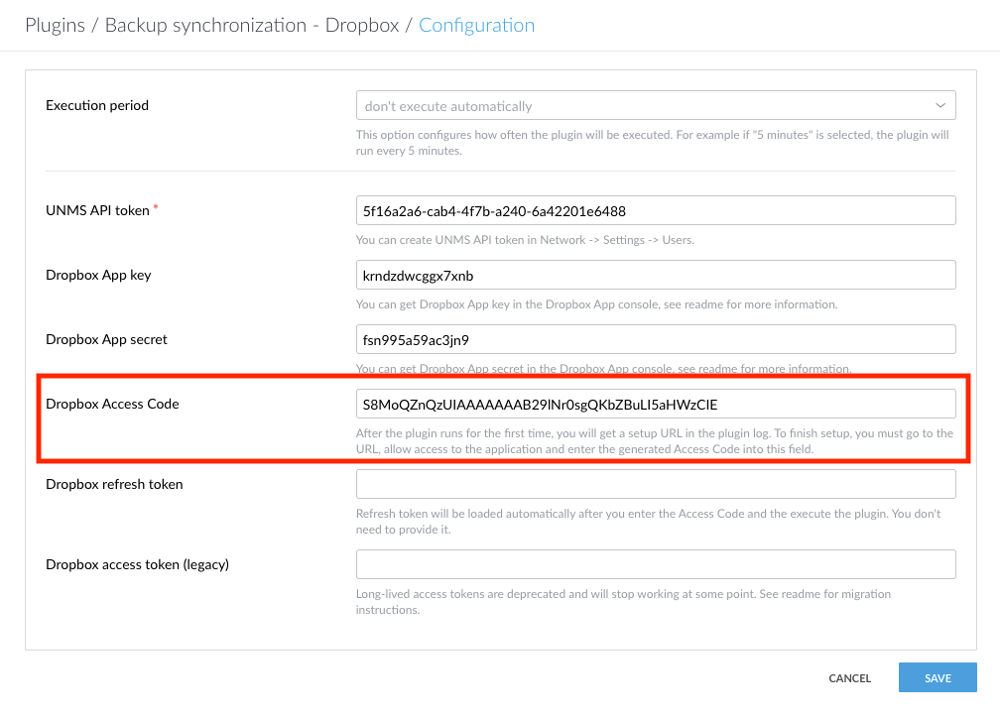

# Backup synchronization - Dropbox
This plugin handles synchronization of your UNMS backups to a Dropbox folder.  
Please note, that backups deleted from UNMS are deleted from Dropbox as well.

## Configuration
### Execution period
Set up an execution period of 24 hours if you want to synchronize your backups automatically. UNMS generates a backup once per day, so 24 hours is more than enough.

### UNMS API token
You can create a UNMS API token in Network -> Settings -> Users.

### Dropbox setup
1. Go to the Dropbox App console - https://www.dropbox.com/developers/apps
2. Click the "Create app" button.
3. Choose the "Scoped access" option.

4. Choose the "App folder" access type.
5. Enter any name you want for the app, e.g. "UNMS backups".
6. Submit the "Create app" form.
7. You will be redirected to the app info page.
8. Switch to the "Permissions" tab and enable the `files.metadata.read` and `files.content.write` permissions.

9. Switch to the "Settings" tab, grab the "App key" and "App secret" values and fill them in the CRM plugin configuration.

10. Go to the plugin detail page in CRM and click the "execute manually" button. Refresh the page after about a minute, copy the authorization URL and access it in your browser. Go through the Dropbox authorization process and copy the generated Access Code into CRM plugin configuration. 

11. Execute the plugin manually again to finish the setup. The plugin will generate a "refresh token" and use it to create short-lived access tokens when needed.

The backups will then appear in the app folder, if you open you dropbox files, go to "Apps" and then to a folder named after your application:  

### Migrating from long-lived access tokens
Dropbox is deprecating long-lived access tokens and the plugin might stop working at some point, unless you migrate to short-lived access tokens. To migrate, simply delete the value from the "Dropbox access token (legacy)" field in CRM plugin configuration and refer to Dropbox setup instructions above.
