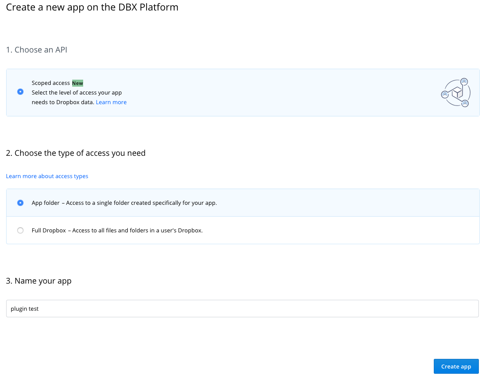
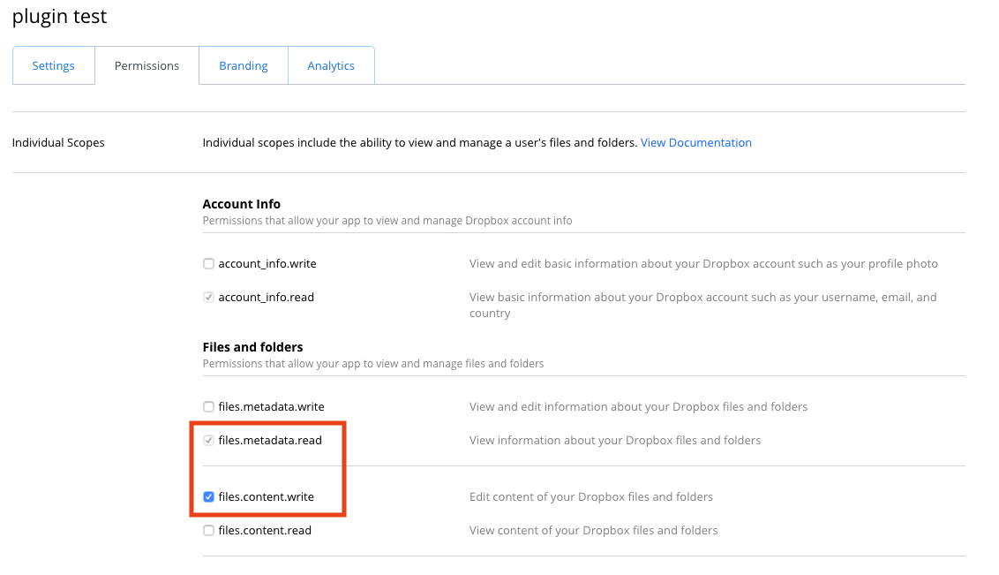
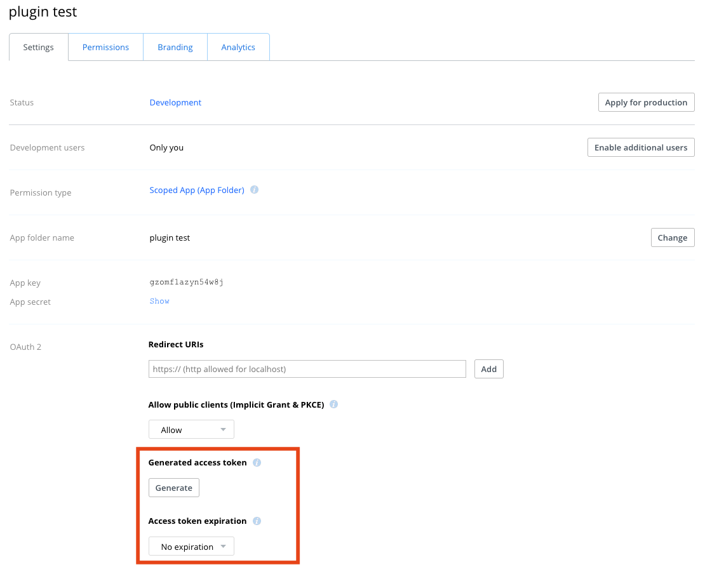
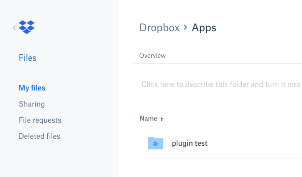

# Backup synchronization - Dropbox
This plugin handles synchronization of your UNMS backups to a Dropbox folder.  
Please note, that backups deleted from UNMS are deleted from Dropbox as well.

## Configuration
### Execution period
Set up an execution period of 24 hours if you want to synchronize your backups automatically. UNMS generates a backup once per day, so 24 hours is more than enough.

### UNMS API token
You can create a UNMS API token in Network -> Settings -> Users.

### Dropbox access token
To generate an access token:
1. Go to the Dropbox App console - https://www.dropbox.com/developers/apps
2. Click the "Create app" button.
3. Choose the "Scoped access" option.

4. Choose the "App folder" access type.
5. Enter any name you want for the app, e.g. "UNMS backups".
6. Submit the "Create app" form.
7. You will be redirected to the app info page.
8. Switch to the "Permissions" tab and enable the `files.metadata.read` and `files.content.write` permissions.

9. Switch to the "Settings" tab, scroll to the "Access token expiration" and change the value to "No expiration".
10. Then click the "Generate" button under the "Generated access token" section and copy the value into the plugin configuration.

  
The backups will then appear in the app folder, if you open you dropbox files, go to "Apps" and then to a folder named after your application:  

